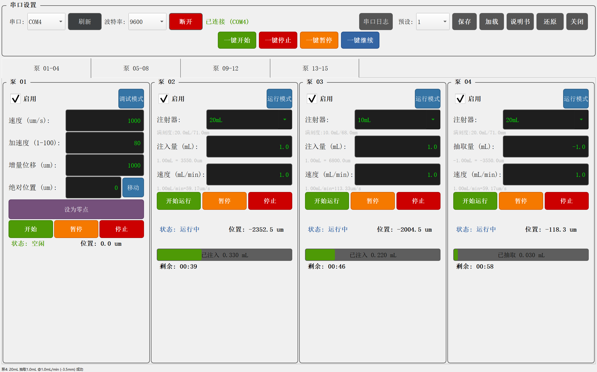

# 注射泵 RS485 控制系统

基于 PyQt5 + Modbus RTU 的多注射泵串口控制软件，支持同时控制最多 15 台注射泵设备。

## 功能

- **调试模式**：手动设置速度 (um/s)、加速度、增量位移、绝对位置、零点校准
- **运行模式**：选择注射器型号 (1mL/2.5mL/10mL/20mL)，设置注射量 (mL) 和注射速度 (mL/min)，实时显示运行进度与剩余时间
- **设备管理**：15 个设备可独立启用/禁用，启用的设备自动轮询状态
- **串口日志**：实时显示所有 Modbus RTU 收发数据，支持彩色标记 TX/RX/ERR/SYS
- **触摸屏支持**：数值输入弹出数字键盘，按钮尺寸适配触摸操作

## 硬件要求

- RS485 转 USB 串口适配器
- 支持 Modbus RTU 协议的注射泵设备（地址 0x01 - 0x0F）

## 安装

```bash
# 克隆仓库
git clone https://github.com/HXBJ1737/inj.git
cd raspi-inj

# 创建虚拟环境
python -m venv .venv
source .venv/bin/activate  # Linux/macOS
# .venv\Scripts\activate   # Windows

# 安装依赖
pip install -r requirements.txt
```

## 运行

```bash
python main.py
```

## 使用步骤

1. 在顶部工具栏选择串口号和波特率（默认 9600）
2. 点击 **连接** 按钮建立通信
3. 勾选需要控制的设备启用框
4. 在 **调试模式** 或 **运行模式** 中设置参数并执行
5. 点击 **串口日志** 按钮查看实时通信数据

## 项目结构

```
├── main.py              # 程序入口
├── main_window.py       # 主窗口与串口日志面板
├── pump_widget.py       # 注射泵控制组件（调试/运行模式）
├── pump_controller.py   # Modbus 寄存器读写封装
├── modbus_client.py     # RS485 串口通信层
├── data.csv             # 注射器型号数据
└── requirements.txt     # Python 依赖
```

